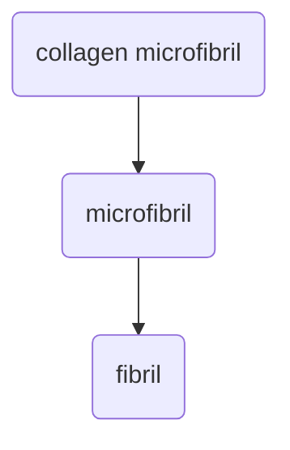

+++
date = '2025-02-03T09:03:33-07:00'
draft = false
title = 'Week4'
+++

## Soft Tissue Functions

- deformation
- fatigue resistance
- tear/fracture resistance

**Crimping:** part of stress strain curve
occurs in "toe region" with no tension. This occurs in collagen dense tissues. What is the purpose of this???

## building blocks of soft tissue

- **Collagen:**
    - tensile strength
- **Elastin:**
    - tissue extensibility
- **Proteoglycans & glycosamino-glycans:**
    - allows cartilage to take on compressive load without fracturing

**Multi-level structure:** alter material properties of a tissue, add strenght, hard to create synthetically

**isotropy:** homogeneity in all directions

**Anisotropic tissues** different physical properties along differenc axes.

*why is collagen more organized in ligaments than tendons?*

*Do collagen fibers have "cross-bridges"???*
